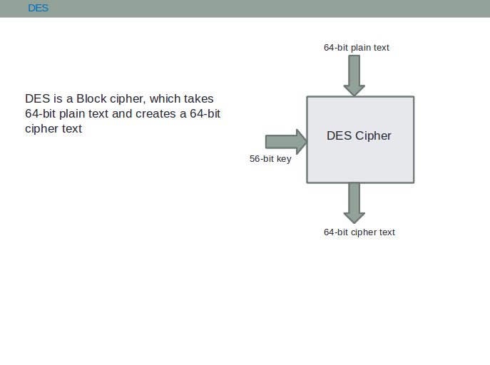

For a very brief theory of Data Encryption Standard and their analysis, click [here](docs/DES1.pdf)

The Data Encryption Standard (DES) is a symmetric-key block cipher that was adopted as a federal standard in the United States in 1977. DES encrypts data in 64-bit blocks using a 56-bit key (with 8 parity bits for a total of 64 bits). However, as computing power increased, the security of DES became insufficient, leading to the development of Triple DES (3DES).

### How DES Works

1. **Block Size**: DES operates on 64-bit blocks of plaintext
2. **Key Size**: Uses a 56-bit effective key (64-bit key with 8 parity bits)
3. **Rounds**: Performs 16 rounds of encryption operations
4. **Structure**: Uses a Feistel network structure with substitution and permutation operations

### Triple DES (3DES) Enhancement

Triple DES was developed to address DES vulnerabilities by applying the DES algorithm three times:

1. **First Stage**: Encrypt the plaintext with Key A
2. **Second Stage**: Decrypt the result with Key B
3. **Third Stage**: Encrypt the result with Key A again

### Mathematical Representation

- **DES Encryption**: C = DES_K(P)
- **DES Decryption**: P = DES⁻¹_K(C)
- **Triple DES**: C = DES_KeyA(DES⁻¹_KeyB(DES_KeyA(P)))

Where:

- P is the plaintext (64 bits)
- C is the ciphertext (64 bits)
- K is the encryption key (56-bit effective)
- KeyA and KeyB are the two keys used in 3DES

### Security Analysis

#### DES Vulnerabilities:

1. **Key Size**: 56-bit key is vulnerable to brute force attacks
2. **Computing Power**: Modern computers can break DES in hours
3. **Cryptanalysis**: Susceptible to differential and linear cryptanalysis

#### Triple DES Advantages:

1. **Effective Key Length**: Approximately 112-bit security
2. **Backward Compatibility**: Can decrypt single DES when KeyA = KeyB
3. **Proven Security**: More resistant to known cryptanalytic attacks

### Breaking and Security Considerations

#### DES can be broken using:

1. **Brute Force Attack**: All 2⁵⁶ possible keys can be tested
2. **Differential Cryptanalysis**: Exploits patterns in encryption rounds
3. **Linear Cryptanalysis**: Uses linear approximations of the cipher

#### Triple DES Security:

- **Meet-in-the-Middle Attack**: Reduces effective security to 2¹¹² operations
- **Still Secure**: Computationally infeasible with current technology
- **Performance Trade-off**: Three times slower than single DES but significantly more secure
